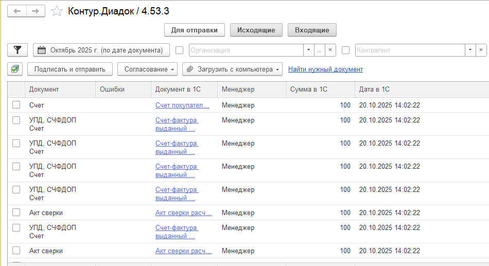

# Дополнительные колонки в форме «Контур.Диадок» в 1С

В этой статье показано, как добавить дополнительные колонки в форму модуля **«Контур.Диадок» в 1С** с помощью подключаемого модуля.

## Задача

При работе с модулем «Контур.Диадок» в 1С у пользователей может возникнуть необходимость видеть в списке документов дополнительную информацию, например:

- менеджера;
- внутренний комментарий;
- сумму документа в 1С;
- дату документа;
- другие пользовательские данные.

Добавить такие данные в форму можно с помощью **подключаемого модуля Диадок**.

Документация:

- [Функции подключаемого модуля](https://developer.kontur.ru/Docs/Diadoc_UM/func/_Functions_PM.html)
- [Доработка списка документов](https://developer.kontur.ru/Docs/Diadoc_UM/proc/Dorabotka_Spiska_Dokumentov.html)

В документации Диадок описан механизм добавления дополнительных колонок. Ниже рассмотрим его более подробно на практическом примере.

## Исходные данные

Пример выполнен для:

**Модуль:** Универсальный  
**Версия:** 4.53.3

В примере добавим три дополнительные колонки:

| Колонка | Тип |
|---|---|
| Менеджер | Строка |
| Сумма в 1С | Число |
| Дата в 1С | Дата |

## 1. Добавляем дополнительные колонки

В функции `ОбработатьСобытие()` подключаемого модуля необходимо обработать событие:

```text
ПолучитьНастройкиДополнительныхКолонокСпискаДокументов
```

В параметре `Результат_ИМ` передается массив, в который необходимо добавить описание дополнительных колонок.

```bsl
Функция ОбработатьСобытие(ИмяСобытия, Параметры) Экспорт

    // ...

    Если ИмяСобытия = "ПолучитьНастройкиДополнительныхКолонокСпискаДокументов" Тогда
        Если Параметры.Свойство("Результат_ИМ") Тогда
            ДобавитьДопКолонки(Параметры);
        КонецЕсли;
    КонецЕсли;

    Если ИмяСобытия = "ПослеОбновленияСпискаДокументов" Тогда
        Если Параметры.Свойство("СписокДокументов") Тогда
            ЗаполнитьДопКолонки(Параметры);
        КонецЕсли;
    КонецЕсли;

    // ...

КонецФункции
```

Создадим функцию `ДобавитьДопКолонки()`:

```bsl
Функция ДобавитьДопКолонки(Параметры)

    ОписаниеТипаСтрока = Новый ОписаниеТипов("Строка");
    ОписаниеТипаЧисло = Новый ОписаниеТипов("Число");
    ОписаниеТипаДата = Новый ОписаниеТипов("Дата");

    ОписаниеКолонкиМенеджер =
        ОписаниеДопКолонки("Менеджер", ОписаниеТипаСтрока);

    ОписаниеКолонкиСуммаВ1С =
        ОписаниеДопКолонки("Сумма в 1С", ОписаниеТипаЧисло);

    ОписаниеКолонкиДатаВ1С =
        ОписаниеДопКолонки("Дата в 1С", ОписаниеТипаДата);

    Параметры.Результат_ИМ.Добавить(ОписаниеКолонкиМенеджер);
    Параметры.Результат_ИМ.Добавить(ОписаниеКолонкиСуммаВ1С);
    Параметры.Результат_ИМ.Добавить(ОписаниеКолонкиДатаВ1С);

КонецФункции // ДобавитьДопКолонки()
```

Таким образом мы добавили три колонки с разными типами данных:

1. `Строка`;
2. `Число`;
3. `Дата`.

## 2. Заполняем дополнительные колонки

Заполнение значений выполняется при возникновении события:

```text
ПослеОбновленияСпискаДокументов
```

В параметре `СписокДокументов` передается таблица с документами.

Добавленным колонкам соответствуют поля:

```text
ДопРеквизит1
ДопРеквизит2
ДопРеквизит3
```

Номер `ДопРеквизита` соответствует порядку, в котором колонка была добавлена в `Результат_ИМ`.

В данном примере:

```text
ДопРеквизит1 → Менеджер
ДопРеквизит2 → Сумма в 1С
ДопРеквизит3 → Дата в 1С
```

Заполним их:

```bsl
Функция ЗаполнитьДопКолонки(Параметры)

    Для каждого Стр Из Параметры.СписокДокументов Цикл

        Стр.ДопРеквизит1 = ЗаполнитьМенеджера(Стр.Документ);
        Стр.ДопРеквизит2 = ЗаполнитьСумму(Стр.Документ);
        Стр.ДопРеквизит3 = ЗаполнитьДату(Стр.Документ);

    КонецЦикла;

КонецФункции // ЗаполнитьДопКолонки()
```

Функции `ЗаполнитьМенеджера()`, `ЗаполнитьСумму()` и `ЗаполнитьДату()` в данном случае условные — внутри них можно реализовать получение необходимых данных из информационной базы 1С.

## Результат

После выполнения описанных настроек в форме списка документов «Контур.Диадок» появятся дополнительные колонки:



## Важно

В модуле доступно **5 дополнительных колонок**:

```text
ДопРеквизит1
ДопРеквизит2
ДопРеквизит3
ДопРеквизит4
ДопРеквизит5
```

Таким образом, через подключаемый модуль можно вывести в список документов Диадок до пяти дополнительных пользовательских полей.

## Результат

После выполнения описанных настроек в форме списка документов «Контур.Диадок» появятся дополнительные колонки:

**Менеджер | Сумма в 1С | Дата в 1С**

Их значения будут заполняться после обновления списка документов.

Механизм можно использовать для вывода практически любой информации из 1С, которая необходима пользователям при работе с документами Диадок.
